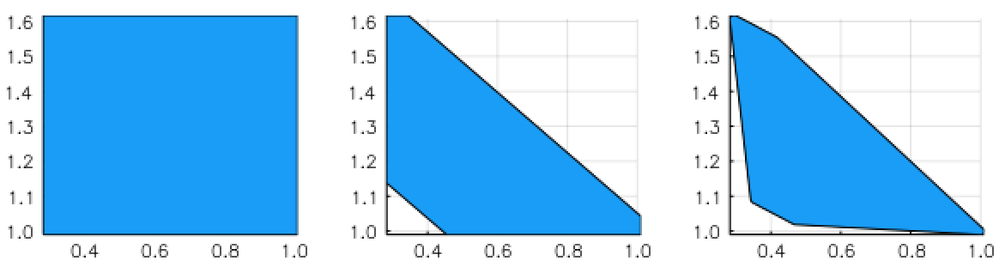

# LazySets.jl

```@meta
CurrentModule = LazySets
```

`LazySets` is a [Julia](http://julialang.org) package for calculus with convex
sets.

The aim is to provide a scalable library for solving complex set-based problems,
such as those encountered in
[differential inclusions](https://en.wikipedia.org/wiki/Differential_inclusion)
or reachability analysis techniques in the domain of
[formal verification](https://en.wikipedia.org/wiki/Formal_verification).
Typically, one is confronted with a set-based recurrence with a given initial
set and/or input sets, and for visualization purposes the final result has to be
obtained through an adequate projection onto low-dimensions.
This library implements types to construct set formulas and methods to
efficiently and accurately approximate the projection in low-dimensions.

```@contents
Pages = ["index.md"]
```

## Introduction

In this package we describe convex sets lazily (i.e., symbolically).
This way we provide an exact but abstract representation, in principle for any
common convex set class or operation between sets.
Concrete information is obtained through evaluating the set in specific
directions.
More precisely, each concrete subtype $\mathcal{X}$ of the abstract type
`LazySet` exports a method to calculate its support vector
$σ(d, \mathcal{X})$ in a given (arbitrary) direction $d \in \mathbb{R}^n$.
Representing sets exactly but lazily has the advantage of being able to perform
only the required operations on-demand.

For very long sequences of computations (e.g., set-based recurrences with tens
of thousands of elements), it is useful to combine both lazy and concrete
representations such as polyhedral approximations.
All this is easy to do with `LazySets`.
Moreover, we provide a specialized module for handling Cartesian decomposition
of two-dimensional projections.
The projection can be taken to the desired precision using an iterative
refinement method.

## Example

Let $\mathcal{X}_0 \subset \mathbb{R}^{1000}$ be the Euclidean ball of center
$(1, \ldots, 1)$ and radius $0.1$ in dimension $n=1000$.
Given a real matrix $A \in \mathbb{R}^{1000 \times 1000}$, suppose that we are
interested in the equation

$\mathcal{Y} = CH(e^{A δ} \mathcal{X}_0 ⊕ δ B\mathcal{U}, \mathcal{X}_0),$

where $CH$ is the convex hull operator, $⊕$ denotes Minkowski sum, $\mathcal{U}$
is a ball in the infinity norm centered at zero and radius $1.2$, and $B$ is a
linear map of the appropriate dimensions.
This equation typically arises in the study of discrete approximation models for
reachability of continuous systems, see for example
[SpaceEx: Scalable verification of hybrid systems](https://github.com/JuliaReach/Reachability.jl/wiki/References#frehse2011spaceex).

For concreteness, we take $A$ to be a random matrix with probability $1\%$ of
any entry being nonzero.
Suppose that the input set $\mathcal{U}$ is two-dimensional, and that the linear
map $B$ is random.
Finally, let δ = 0.1.
Using `LazySets`, we can define this problem as follows:

```jldoctest index_label
julia> using LazySets, SparseArrays, LinearAlgebra

julia> A = sprandn(1000, 1000, 0.01);

julia> δ = 0.1;

julia> X0 = Ball2(ones(1000), 0.1);

julia> B = randn(1000, 2);

julia> U = BallInf(zeros(2), 1.2);

```

The `@time` macro shows that building $\mathcal{Y}$ with `LazySets` is
instantaneous.

```jldoctest index_label
julia> using Expokit

julia> Y = CH(SparseMatrixExp(A * δ) * X0 + δ * B * U, X0);
```

By asking for the concrete type of `Y`, we see that it has a convex hull type,
parameterized by the types of its arguments, corresponding to the mathematical
formulation:

```jldoctest index_label
julia> typeof(Y)
ConvexHull{Float64,MinkowskiSum{Float64,ExponentialMap{Float64,Ball2{Float64}},LinearMap{Float64,BallInf{Float64},Float64,Array{Float64,2}}},Ball2{Float64}}
```

Now suppose that we are interested in observing the projection of $\mathcal{Y}$
onto the variables number 1 and 500.
First we define the $2×1000$ projection matrix and apply it to $\mathcal{Y}$ as
a linear map (i.e., from the left).
Second, we use the `overapproximate` method:

```jldoctest index_label
julia> proj_mat = [[1. zeros(1, 999)]; [zeros(1, 499) 1. zeros(1, 500)]];

julia> res = Approximations.overapproximate(proj_mat * Y);
```

We have calculated a box overapproximation of the exact projection onto the
$(x_1, x_{500})$ plane.
Notice that it takes about 0.064 seconds for the whole operation, allocating
less than 10MB of RAM.
Let us note that if the set operations were done explicitly, this would be much
(!) slower.
For instance, already the explicit computation of the matrix exponential would
have cost 10x more, and allocated around 300MB.
For even higher $n$, an evaluation will probably run out of RAM.
But this is doable with `LazySets` because the *action* of the matrix
exponential on the set is only evaluated along the directions of interest.
Similar comments apply to the Minkowski sum above.

We can visualize the result using `plot`, as shown below (left-most plot).



In the second and third plots, we have used a refined method that allows to
specify a prescribed accuracy for the projection (in terms of the
[Hausdorff distance](https://en.wikipedia.org/wiki/Hausdorff_distance)).
For the theoretical background, see
[this reference](https://github.com/JuliaReach/Reachability.jl/wiki/References#polyhedral-approximations).
It can be passed as a second argument to `overapproximate`.

|Error tol.|time (s)|memory (MB)|
|------|------|------|
|∞ (no refinement)|0.022|5.27|
|1e-1|0.051|7.91|
|1e-3|0.17|30.3|

This table shows the runtime and memory consumption for different error
tolerances, and the results are shown in three plots of above, from left to
right.
When passing to a smaller tolerance, the corners connecting edges are more
"rounded", at the expense of computational resources, since more support vectors
have to be evaluated.

## Features

The core functionality of `LazySets` is:

- Lazy (i.e., symbolic) types for several classes of convex sets such as balls
  in different norms, polygons in constraint or vertex representation,
  zonotopes, special types such as lines and linear constraints,
  hyperrectangles, and high-dimensional polyhedra.
- Lazy implementations for most commonly used set operations, e.g., Minkowski
  sum, Cartesian product, convex hull and interval hull approximations, and
  linear and exponential maps.

On top of the previous basic type representations and operations, `LazySets` can
be used to:

- Efficiently evaluate the support vector of nested lazy sets.
- Cartesian decomposition of lazy sets using two-dimensional projections.
- Fast overapproximation of an exact set using a polyhedral approximation, to
  the desired accuracy.
- Extensive visualization capabilities through the
  [Plots.jl](http://docs.juliaplots.org/latest/) framework.

## Manual Outline

```@contents
Pages = [
    "man/getting_started.md",
    "man/polyhedral_approximations.md",
    "man/decompose_example.md",
    "man/fast_2d_LPs.md",
    "man/iterative_refinement.md",
    "man/interval_hulls.md",
    "man/convex_hulls.md",
    "man/set_operations.md",
    "man/reach_zonotopes.md",
    "man/reach_zonotopes_hybrid.md",
    "man/concrete_polyhedra.md",
    "man/parallel_approximations.md",
    "man/lazy_intersections.md"
]
Depth = 2
```

## Library Outline

```@contents
Pages = [
    "lib/interfaces.md",
    "lib/sets/Hyperrectangle.md",
    "lib/sets/BallInf.md",
    "lib/sets/Interval.md",
    "lib/sets/Singleton.md",
    "lib/sets/ZeroSet.md",
    "lib/sets/HalfSpace.md",
    "lib/sets/HPolyhedron.md",
    "lib/sets/Hyperplane.md",
    "lib/sets/Line.md",
    "lib/sets/Universe.md",
    "lib/sets/HPolytope.md",
    "lib/sets/VPolytope.md",
    "lib/sets/HPolygon.md",
    "lib/sets/HPolygonOpt.md",
    "lib/sets/VPolygon.md",
    "lib/sets/Zonotope.md",
    "lib/sets/LineSegment.md",
    "lib/sets/Ball1.md",
    "lib/sets/EmptySet.md",
    "lib/sets/Ball2.md",
    "lib/sets/Ellipsoid.md",
    "lib/sets/Ballp.md",
    "lib/sets/PolynomialZonotope.md",
    "lib/lazy_operations/Bloating.md",
    "lib/lazy_operations/CartesianProduct.md",
    "lib/lazy_operations/ConvexHull.md",
    "lib/lazy_operations/Intersection.md",
    "lib/lazy_operations/MinkowskiSum.md",
    "lib/lazy_operations/LinearMap.md",
    "lib/lazy_operations/ExponentialMap.md",
    "lib/lazy_operations/ResetMap.md",
    "lib/lazy_operations/Translation.md",
    "lib/lazy_operations/AffineMap.md",
    "lib/lazy_operations/SymmetricIntervalHull.md",
    "lib/lazy_operations/UnionSet.md",
    "lib/lazy_operations/Complement.md",
    "lib/lazy_operations/Rectification.md",
    "lib/comparisons.md",
    "lib/conversion.md",
    "lib/binary_functions.md",
    "lib/approximations.md",
    "lib/utils.md",
    "lib/parallel.md"
]
Depth = 2
```
