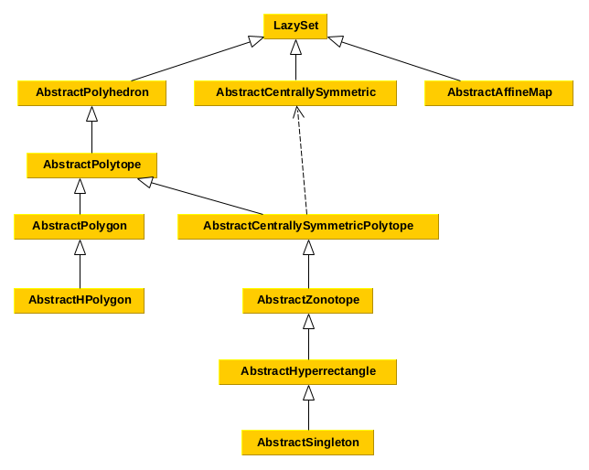

# Set Interfaces

This section of the manual describes the interfaces for different set types.
Every set that fits the description of an interface should also implement it.
This helps in several ways:
- avoid code duplicates,
- provide functions for many sets at once,
- allow changes in the source code without changing the API.

The interface functions are outlined in the interface documentation.
See [Common Set Representations](@ref) for implementations of the interfaces.

!!! note
    The naming convention is such that all interface names (with the exception
    of the main abstract type `LazySet`) should be preceded by `Abstract`.

The following diagram shows the interface hierarchy.



```@contents
Pages = ["interfaces.md"]
Depth = 4
```

```@meta
CurrentModule = LazySets
```

## LazySet

Every convex set in this library implements this interface.

```@docs
LazySet
```

### Support function and support vector

Every `LazySet` type must define a function `σ` to compute the support vector.

```@docs
support_vector
ρ(::AbstractVector{N}, ::LazySet{N}) where {N<:Real}
support_function
σ
```

### Other globally defined set functions

```@docs
norm(::LazySet, ::Real=Inf)
radius(::LazySet, ::Real=Inf)
diameter(::LazySet, ::Real=Inf)
isbounded(::LazySet)
isbounded_unit_dimensions(::LazySet{N}) where {N<:Real}
an_element(::LazySet{N}) where {N<:Real}
tosimplehrep(::LazySet)
isuniversal(::LazySet{N}, ::Bool=false) where {N<:Real}
affine_map(M::AbstractMatrix, X::LazySet, v::AbstractVector)
```

Plotting is available for general one- or two-dimensional `LazySet`s, provided
that the overapproximation using iterative refinement is available:

```@docs
plot_recipe(::LazySet{N}, ::N=N(1e-3)) where {N<:Real}
RecipesBase.apply_recipe(::Dict{Symbol,Any}, ::LazySet{N}, ::N=N(1e-3)) where {N<:Real}
RecipesBase.apply_recipe(::Dict{Symbol,Any}, ::AbstractVector{VN}, ::N=N(1e-3), ::Int=40, ::Bool=false) where {N<:Real, VN<:LazySet{N}}
```

### Set functions that override Base functions

```@docs
==(::LazySet, ::LazySet)
≈(::LazySet, ::LazySet)
copy(::LazySet)
```

### Aliases for set types

```@docs
CompactSet
NonCompactSet
```

## Centrally symmetric set

Centrally symmetric sets such as balls of different norms are characterized by a
center.
Note that there is a special interface combination
[Centrally symmetric polytope](@ref).

```@docs
AbstractCentrallySymmetric
```

This interface defines the following functions:

```@docs
dim(::AbstractCentrallySymmetric)
isbounded(::AbstractCentrallySymmetric)
an_element(::AbstractCentrallySymmetric{N}) where {N<:Real}
isempty(::AbstractCentrallySymmetric)
```

## Polyhedron

A polyhedron has finitely many facets (*H-representation*) and is not
necessarily bounded.

```@docs
AbstractPolyhedron
```

This interface defines the following functions:

```@docs
∈(::AbstractVector{N}, ::AbstractPolyhedron{N}) where {N<:Real}
constrained_dimensions(::AbstractPolyhedron)
linear_map(::AbstractMatrix{N}, ::AbstractPolyhedron{N}) where {N<:Real}
```

Plotting (bounded) polyhedra is available, too:

```@docs
plot_recipe(::AbstractPolyhedron{N}, ::N=zero(N)) where {N<:Real}
```

### Polytope

A polytope is a bounded set with finitely many vertices (*V-representation*)
resp. facets (*H-representation*).
Note that there is a special interface combination
[Centrally symmetric polytope](@ref).

```@docs
AbstractPolytope
```

This interface defines the following functions:

```@docs
isbounded(::AbstractPolytope)
singleton_list(::AbstractPolytope{N}) where {N<:Real}
isempty(::AbstractPolytope)
chebyshev_center(::AbstractPolytope{N}) where {N<:Real}
```

#### Polygon

A polygon is a two-dimensional polytope.

```@docs
AbstractPolygon
```

This interface defines the following functions:

```@docs
dim(P::AbstractPolygon)
linear_map(::AbstractMatrix{N}, P::AbstractPolygon{N}) where {N<:Real}
```

##### HPolygon

An HPolygon is a polygon in H-representation (or constraint representation).

```@docs
AbstractHPolygon
```

This interface defines the following functions:

```@docs
an_element(::AbstractHPolygon{N}) where {N<:Real}
∈(::AbstractVector{N}, ::AbstractHPolygon{N}) where {N<:Real}
rand(::Type{HPOLYGON}) where {HPOLYGON<:AbstractHPolygon}
tohrep(::HPOLYGON) where {HPOLYGON<:AbstractHPolygon}
tovrep(::AbstractHPolygon{N}) where {N<:Real}
addconstraint!(::AbstractHPolygon{N}, ::LinearConstraint{N}) where {N<:Real}
addconstraint!(::Vector{LC}, ::LinearConstraint{N}) where {N<:Real, LC<:LinearConstraint{N}}
isredundant(::LinearConstraint{N}, ::LinearConstraint{N}, ::LinearConstraint{N}) where {N<:Real}
remove_redundant_constraints!(::AbstractHPolygon)
constraints_list(::AbstractHPolygon{N}) where {N<:Real}
vertices_list(::AbstractHPolygon{N}, ::Bool=false, ::Bool=true) where {N<:Real}
isbounded(::AbstractHPolygon, ::Bool=true)
```

#### Centrally symmetric polytope

A centrally symmetric polytope is a combination of two other interfaces:
[Centrally symmetric set](@ref) and [Polytope](@ref).

```@docs
AbstractCentrallySymmetricPolytope
```

This interface defines the following functions:

```@docs
dim(::AbstractCentrallySymmetricPolytope)
an_element(::AbstractCentrallySymmetricPolytope{N}) where {N<:Real}
isempty(::AbstractCentrallySymmetricPolytope)
```

##### AbstractZonotope

A zonotope is a specific centrally symmetric polytope characterized by a
center and a collection of generators.

```@docs
AbstractZonotope
```

This interface defines the following functions:

```@docs
ngens(::AbstractZonotope)
genmat_fallback(::AbstractZonotope{N}) where {N<:Real}
generators_fallback(::AbstractZonotope{N}) where {N<:Real}
ρ(::AbstractVector{N}, ::AbstractZonotope{N}) where {N<:Real}
σ(::AbstractVector{N}, ::AbstractZonotope{N}) where {N<:Real}
∈(::AbstractVector{N}, ::AbstractZonotope{N}) where {N<:Real}
linear_map(::AbstractMatrix{N}, ::AbstractZonotope{N}) where {N<:Real}
translate(::AbstractZonotope{N}, ::AbstractVector{N}) where {N<:Real}
constraints_list(::AbstractZonotope{N}) where {N<:Real}
constraints_list(::AbstractZonotope{N}; ::Bool=true) where {N<:AbstractFloat}
vertices_list(::AbstractZonotope{N}) where {N<:Real}
order(::AbstractZonotope)
```

##### Hyperrectangle

A hyperrectangle is a special centrally symmetric polytope with axis-aligned
facets.

```@docs
AbstractHyperrectangle
```

This interface defines the following functions:

```@docs
norm(::AbstractHyperrectangle, ::Real=Inf)
radius(::AbstractHyperrectangle, ::Real=Inf)
σ(::AbstractVector{N}, ::AbstractHyperrectangle{N}) where {N<:Real}
ρ(::AbstractVector{N}, ::AbstractHyperrectangle{N}) where {N<:Real}
∈(::AbstractVector{N}, ::AbstractHyperrectangle{N}) where {N<:Real}
vertices_list(::AbstractHyperrectangle{N}) where {N<:Real}
constraints_list(::AbstractHyperrectangle{N}) where {N<:Real}
high(::AbstractHyperrectangle{N}) where {N<:Real}
high(::AbstractHyperrectangle{N}, ::Int) where {N<:Real}
low(::AbstractHyperrectangle{N}) where {N<:Real}
low(::AbstractHyperrectangle{N}, ::Int) where {N<:Real}
isflat(::AbstractHyperrectangle)
split(::AbstractHyperrectangle{N}, ::AbstractVector{Int}) where {N<:Real}
generators(::AbstractHyperrectangle)
genmat(::AbstractHyperrectangle)
ngens(::AbstractHyperrectangle{N}) where {N<:Real}
rectify(::AbstractHyperrectangle)
```

##### Singleton

A singleton is a special hyperrectangle consisting of only one point.

```@docs
AbstractSingleton
```

This interface defines the following functions:

```@docs
σ(::AbstractVector{N}, ::AbstractSingleton{N}) where {N<:Real}
ρ(::AbstractVector{N}, ::AbstractSingleton{N}) where {N<:Real}
∈(::AbstractVector{N}, ::AbstractSingleton{N}) where {N<:Real}
an_element(::AbstractSingleton{N}) where {N<:Real}
center(::AbstractSingleton{N}) where {N<:Real}
vertices_list(::AbstractSingleton{N}) where {N<:Real}
radius_hyperrectangle(::AbstractSingleton{N}) where {N<:Real}
radius_hyperrectangle(::AbstractSingleton{N}, ::Int) where {N<:Real}
high(::AbstractSingleton{N}) where {N<:Real}
high(::AbstractSingleton{N}, ::Int) where {N<:Real}
low(::AbstractSingleton{N}) where {N<:Real}
low(::AbstractSingleton{N}, ::Int) where {N<:Real}
linear_map(::AbstractMatrix{N}, ::AbstractSingleton{N}) where {N<:Real}
generators(::AbstractSingleton{N}) where {N<:Real}
genmat(::AbstractSingleton{N}) where {N<:Real}
ngens(::AbstractSingleton)
plot_recipe(::AbstractSingleton{N}, ::N=zero(N)) where {N<:Real}
RecipesBase.apply_recipe(::Dict{Symbol,Any}, ::AbstractSingleton{N}, ::N=zero(N)) where {N<:Real}
```
