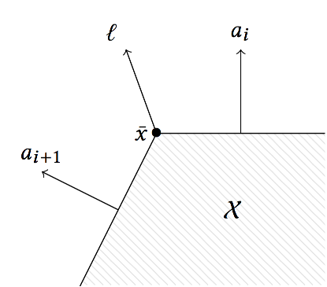

# Approximations

This section of the manual describes the Cartesian decomposition algorithms and
the approximation of high-dimensional convex sets using projections.

```@contents
Pages = ["approximations.md"]
```

```@meta
CurrentModule = LazySets.Approximations
```

## Cartesian Decomposition

```@docs
decompose
overapproximate
```

## Box Approximations

```@docs
ballinf_approximation
box_approximation
box_approximation_symmetric
diameter_approximation
radius_approximation
```

## Fast 2D LPs

Since vectors in the plane can be ordered
by the angle with respect to the positive real axis, we can efficiently evaluate
the support vector of a polygon in constraint representation by comparing normal directions, provided that its edges are ordered. We use the symbol $\preceq$ to compare directions, where the increasing direction is counter-clockwise.


```@docs
jump2pi
```


