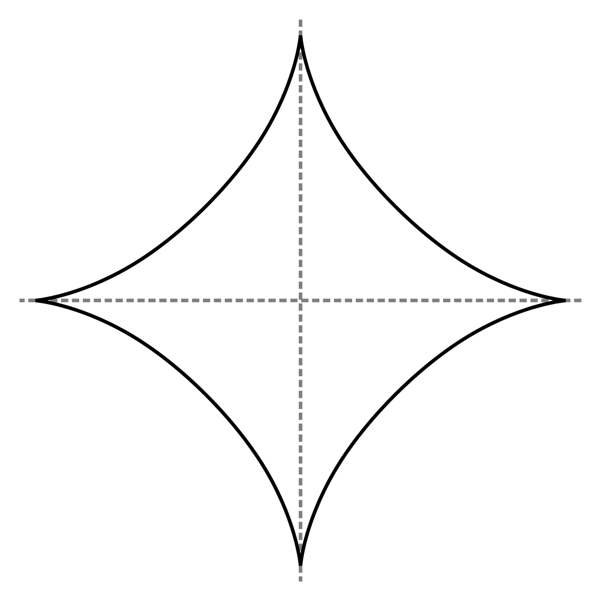

# Introduction to Convex Sets

In this section we give a short overview about convex sets supported in this
library and the corresponding lazy set calculus using support functions.

```@contents
Pages = ["convex_sets.md"]
Depth = 4
```

```@setup convex_sets
using LazySets, Plots, Plots.PlotMeasures, LaTeXStrings

c1 = "blue"
c2 = "green"
c3 = "red"
c4 = "orange"

function plot_raw()
    plot(tickfont=font(30, "Times"), guidefontsize=45, aspectratio=1,
         size=(300, 300), leg=false)
end

function plotX(X, ε, modify, color; linecolor="black")
    if !modify
        plot_raw()
    end
    plot!(X, ε, color=color, alpha=0.7, linecolor=linecolor)
end

function plotX(X, modify, color; linecolor="black")
    if !modify
        plot_raw()
    end
    plot!(X, color=color, alpha=0.7, linecolor=linecolor)
end

function plot1(X, modify::Bool=false; linecolor="black")
    plotX(X, modify, c1, linecolor=linecolor)
end

function plot2(X, modify::Bool=false; linecolor="black")
    plotX(X, modify, c2, linecolor=linecolor)
end

function plot3(X, modify::Bool=false; linecolor="black")
    plotX(X, modify, c3, linecolor=linecolor)
end

function plot1(X, ε::Float64, modify::Bool=false; linecolor="black")
    plotX(X, ε, modify, c1, linecolor=linecolor)
end

function plot2(X, ε::Float64, modify::Bool=false; linecolor="black")
    plotX(X, ε, modify, c2, linecolor=linecolor)
end

function plot3(X, ε::Float64, modify::Bool=false; linecolor="black")
    plotX(X, ε, modify, c3, linecolor=linecolor)
end

function plot_hyperplane!(x, y, linecolor)
    plot!(x, y, linecolor=linecolor, arrow=:arrow, width=8)
    plot!([x[2], x[1]], [y[2], y[1]], linecolor=linecolor, arrow=:arrow, width=8)
end
```

## Basic convex sets

A set ``X ⊆ ℝⁿ`` is convex if for any two points ``x``, ``y`` in ``X`` the whole
line segment connecting ``x`` and ``y`` is also contained in ``X``.
Formally:

```math
    X = \{λ · ~ x + (1 − λ) · y \mid x, y ∈ X , λ ∈ [0, 1] ⊆ ℝ\}
```

Below we show an example of a convex set and a non-convex set.

```@example convex_sets
pentagon = VPolygon([[1., 2.], [2., 1.], [1.5, 0.], [0.5, 0.], [0., 1.]])

plot_raw()  # hide
plot!(xlims=(0., 2.), ylims=(0., 2.), xticks=[0., 1., 2.],  # hide
      yticks=[1., 2.], top_margin=3mm)  # hide
plot1(pentagon, true)  # hide
```

```@example convex_sets
hourglass = [VPolygon([[0., 2.], [1., 0.9], [2, 2.]]),
             VPolygon([[0., 0.], [1., 1.1], [2, 0.]])]

plot_raw()  # hide
plot!(xlims=(0., 2.), ylims=(0., 2.), xticks=[0., 1., 2.],  # hide
      yticks=[1., 2.], top_margin=3mm)  # hide
plot3(hourglass, true; linecolor=c3)  # hide
```

### Empty set

The simplest convex set is the empty set.

```@example convex_sets
E = EmptySet()

plot_raw()  # hide
plot!(xlims=(0., 2.), ylims=(0., 2.), xticks=[0., 1., 2.],  # hide
      yticks=[1., 2.], top_margin=3mm)  # hide
plot1(E, true)  # hide
```

### Singleton

The next simplest convex set is the singleton, which consists of a single point.

```@example convex_sets
S = Singleton([1.0, 1.0])

plot_raw()  # hide
plot!(S, markercolor=c2, markersize=10, xlims=(0., 2.), ylims=(0., 2.),  # hide
      xticks=[0., 1., 2.], yticks=[1., 2.], top_margin=3mm)  # hide
```

### Unit balls

Now we consider sets that represent the unit balls in different ``p``-norms.

```math
    ‖ x = (x_1, …, x_n) ‖_p := \sqrt[^p]{|x_1|^p + … + |x_n|^p}
```

Formally, a unit ball is the sets of points ``x`` with ``‖x‖_p ≤ 1``.

Balls for ``p ≥ 1`` are convex.

#### Infinity norm

The unit ball in the infinity norm (``p = ∞``) is also called *hypercube*.

```@example convex_sets
Bi = BallInf([0.0, 0.0], 1.0)

plot_raw()  # hide
plot!(xlims=(-1., 1.), ylims=(-1., 1.), xticks=[-1., 0., 1.],  # hide
      yticks=[0., 1.], top_margin=3mm)  # hide
plot1(Bi, true)  # hide
```

#### Euclidean norm

The unit ball in the Euclidean norm (``p = 2``) is also called *hypersphere*.

```@example convex_sets
B2 = Ball2([0.0, 0.0], 1.0)

plot_raw()  # hide
plot!(xlims=(-1., 1.), ylims=(-1., 1.), xticks=[-1., 0., 1.],  # hide
      yticks=[0., 1.], top_margin=3mm)  # hide
plot2(B2, true)  # hide
```

#### Manhattan norm

The unit ball in the Manhattan norm (``p = 1``) is also called *cross-polytope*.

```@example convex_sets
B1 = Ball1([0.0, 0.0], 1.0)

plot_raw()  # hide
plot!(xlims=(-1., 1.), ylims=(-1., 1.), xticks=[-1., 0., 1.],  # hide
      yticks=[0., 1.], top_margin=3mm)  # hide
plot3(B1, true)  # hide
```

#### More unit balls

Below we show more exotic example of unit balls for ``p = 3, 42, π``.

```@example convex_sets
B3 = Ballp(3., [0.0, 0.0], 1.0)

plot_raw()  # hide
plot!(xlims=[-1., 1.], ylims=[-1., 1.], xticks=[-1., 0., 1.],  # hide
      yticks=[0., 1.])  # hide
plot1(B3, 1e-5, true)  # hide
```

```@example convex_sets
B42 = Ballp(42., [0.0, 0.0], 1.0)

plot_raw()  # hide
plot!(xlims=[-1., 1.], ylims=[-1., 1.], xticks=[-1., 0., 1.],  # hide
      yticks=[0., 1.])  # hide
plot2(B42, 1e-5, true)  # hide
```

```@example convex_sets
Bπ = Ballp(π - 2., [0.0, 0.0], 1.0)

plot_raw()  # hide
plot!(xlims=[-1., 1.], ylims=[-1., 1.], xticks=[-1., 0., 1.],  # hide
      yticks=[0., 1.])  # hide
plot3(Bπ, 1e-5, true)  # hide
```

Finally, the following example of the unit ball for ``p = 2/3`` demonstrates
that for ``p < 1`` the unit balls are not convex.



[Source: [Wikimedia](https://commons.wikimedia.org/wiki/File:Astroid.svg)]

### Unbounded sets

#### Hyperplane

A hyperplane is the generalization of the line (in 2D) and the plane (in 3D).
Formally, a hyperplane is parametric in a normal vector ``d`` and a constant
``c`` and represents the set of points ``x`` satisfying ``⟨d, x⟩ = c`` (where
``⟨·⟩`` denotes the dot product).

```@example convex_sets
Hp = Hyperplane([1.0, 1.0], 1.0)

x = [0., 1.]  # hide
y = [1., 0.]  # hide
arrow_x = [0.5, 0.7]  # hide
arrow_y = [0.5, 0.7]  # hide
xd = 0.5  # hide
yd = 0.7  # hide

plot_raw()  # hide
plot!(xlims=(0., 1.0), ylims=(0., 1.0), xticks=[0., 1.], yticks=[1.],  # hide
      top_margin=3mm)  # hide
plot_hyperplane!(x, y, c1)  # hide
plot!(arrow_x, arrow_y, linecolor=c3, arrow=:arrow, linestyle=:dot, width=8)  # hide
plot!(annotations=(xd, yd, text(L"d", 30)))  # hide
```

#### Half-space

A half-space is characterized by a hyperplane and represents all points that lie
on one side of that hyperplane.
Formally, it is the set of points ``x`` satisfying ``⟨d, x⟩ ≤ c``.

```@example convex_sets
Hs = HalfSpace([1.0, 1.0], 1.0)

X = VPolygon([[0., 0.], [1., 0.], [0., 1.]])  # hide

plot_raw()  # hide
plot!(xlims=(0., 1.0), ylims=(0., 1.0), xticks=[0., 1.], yticks=[1.],  # hide
      top_margin=3mm)  # hide
plot2(X, true)  # hide
plot_hyperplane!(x, y, c2)  # hide
plot!(arrow_x, arrow_y, linecolor=c3, arrow=:arrow, linestyle=:dot, width=8)  # hide
plot!(annotations=(xd, yd, text(L"d", 30)))  # hide
```
