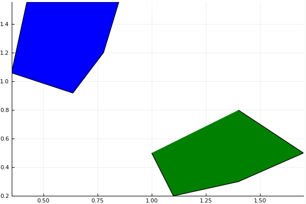
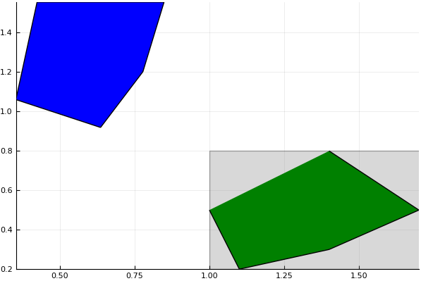
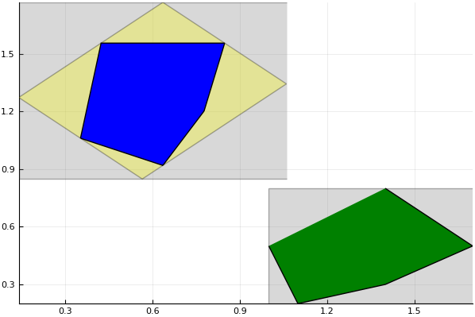

# Decomposing an Affine Map

In this section we present an illustrative example of the *decomposed image*
of a linear map.

```@meta
DocTestSetup = quote
    using LazySets, LazySets.Approximations
end
```

## Preliminaries: Polygon, Linear Map, and Plotting

Let ``θ := π/4`` and
``Φ := \begin{pmatrix} \cos(θ) & -\sin(θ) \\ \sin(θ) & \cos(θ) \end{pmatrix}``.

```jldoctest deco_label
julia> theta = pi/4.;

julia> Φ = [cos(theta) -sin(theta); sin(theta) cos(theta)];

```

Now define an arbitrary convex polygon with five vertices with
``\operatorname{CH}`` denoting the convex hull operation.
``\mathcal{X} := \operatorname{CH}\big( (1, 0.5), (1.1, 0.2), (1.4, 0.3), (1.7, 0.5), (1.4, 0.8) \big)``

```jldoctest deco_label
julia> X = VPolygon([[1.0, 0.5], [1.1, 0.2], [1.4, 0.3], [1.7, 0.5], [1.4, 0.8]])
LazySets.VPolygon{Float64}(Array{Float64,1}[[1.0, 0.5], [1.1, 0.2], [1.4, 0.3], [1.7, 0.5], [1.4, 0.8]])
```

Applying the linear map ``Φ · \mathcal{X}``, we get a new polygon
``\mathcal{X}'`` which is the counter-clockwise turn of
``\mathcal{X}`` by ``θ \triangleq 45°``.
In this package the linear map is not computed explicitly but only wrapped in a
`LinearMap` instance.

```jldoctest deco_label
julia> Xp = Φ * X;

julia> typeof(Xp)
LazySets.LinearMap{LazySets.VPolygon{Float64},Float64}
```

Let us plot the two polygons, ``\mathcal{X}`` in green and ``\mathcal{X}'`` in
blue.

```jldoctest deco_label
julia> using Plots;

julia> plot(X, color="green")

julia> plot!(Xp, 1e-2, color="blue")

```

Note that we have passed `1e-2` as additional argument for the `LinearMap` set
(``\mathcal{X}'``) because by default such a set is just plotted as its box
(or hyperrectangle) approximation.
The value `1e-2` is the precision up to which the set is (over-)approximated
with a polgon, which in this case is sufficient to obtain the actual set again.




## Cartesian Decomposition

Next we want to decompose ``\mathcal{X}`` into a Cartesian product of intervals.
That is, we project it to the x-axis and y-axis and then compose these intervals
again: ``\hat{\mathcal{X}} := \hat{\mathcal{X}}_1 \times \hat{\mathcal{X}}_2``.

```jldoctest deco_label
julia> Xhat = overapproximate(X);

julia> plot(Xhat, color="gray", alpha=0.3)

julia> plot!(X, color="green")

julia> plot!(Xp, 1e-2, color="blue")

```




## Decomposed Image of a Linear Map

Now let us compute the linear map for the box approximation, and let us call it
``\mathcal{Y} := Φ · \hat{\mathcal{X}}``.
This will be a diamond-like shape (the box turned by `45°`).

```jldoctest deco_label
julia> Xphat = Φ * Xhat;

julia> plot(Xhat, color="gray", alpha=0.3)

julia> plot!(X, color="green")

julia> plot!(Xphat, 1e-2, color="yellow", alpha=0.3)

julia> plot!(Xp, 1e-2, color="blue")

```


However, we want our approximation be again a Cartesian product of intervals, so
we have to overapproximate this diamond-like shape again:
``\hat{\mathcal{Y}} = \hat{\mathcal{X}}' = \hat{\mathcal{X}}_1' \times \hat{\mathcal{X}}_2'``

```jldoctest deco_label
julia> Xhatp = overapproximate(Xphat);

julia> plot(Xhat, color="gray", alpha=0.3)

julia> plot!(X, color="green")

julia> plot!(Xhatp, 1e-2, color="gray", alpha=0.3)

julia> plot!(Xphat, 1e-2, color="yellow", alpha=0.3)

julia> plot!(Xp, 1e-2, color="blue")

```



As we can see, the resulting box ``\hat{\mathcal{X}}'`` is *not* a tight
overapproximation of ``\mathcal{X}'``.
We can, however, gain precision by reducing the angle by which we turn the set,
e.g., making two smaller turns.
Why not try it out?
