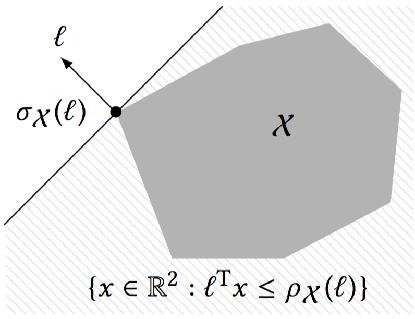

# Getting Started

In this section we set the mathematical notation and review the theoretical
background from convex geometry that is used throughout `LazySets`.
Then, we present an illustrative example of the *decomposed image*
of a linear map.

```@contents
Pages = ["getting_started.md"]
```

## Preliminaries

Let us introduce some notation. Let $\mathbb{I}_n$ be the identity matrix of dimension $n\times n$.
For $p \geq 1$, the $p$-norm of an $n$-dimensional vector $x \in \mathbb{R}^n$ is denoted 
$\Vert x \Vert_p$.


## Support Function

The support function is a basic notion for approximating convex sets. Let
$\mathcal{X} \subset \mathbb{R}^n$ be a compact convex set.
The *support function* of $\mathcal{X}$ is the function
$\rho_\mathcal{X} : \mathbb{R}^n\to \mathbb{R}$, defined as

$\rho_\mathcal{X}(\ell) := \max\limits_{x \in \mathcal{X}} \ell^\mathrm{T} x.$

We recall the following elementary properties of the support function.

**Proposition.** For all compact convex
sets $\mathcal{X}$, $\mathcal{Y}$ in $\mathbb{R}^n$, for all $n\times n$ real
matrices $M$, all scalars $\lambda$, and all vectors $\ell \in \mathbb{R}^n$, we have:

(1.1) $\rho_{\lambda\mathcal{X}} (\ell) = \rho_{\mathcal{X}} (\lambda \ell)$, and
        $\rho_{\lambda\mathcal{X}} (\ell) = \lambda \rho_{\mathcal{X}} (\ell)$ if $\lambda > 0$.

(1.2) $\rho_{M\mathcal{X}} (\ell) = \rho_{\mathcal{X}} (M^\mathrm{T} \ell)$

(1.3) $\rho_{\mathcal{X} \oplus \mathcal{Y}} (\ell) = \rho_{\mathcal{X}} (\ell) + \rho_{\mathcal{Y}} (\ell)$

(1.4) $\rho_{\mathcal{X} \times \mathcal{Y}} (\ell) = \ell^\mathrm{T} \sigma_{\mathcal{X} \times \mathcal{Y}}(\ell)$

(1.5) $\rho_{\mathrm{CH}(\mathcal{X}\cup\mathcal{Y})} (\ell) = \max (\rho_{\mathcal{X}} (\ell), \rho_{\mathcal{Y}} (\ell))$

## Support Vector

The farthest points of $\mathcal{X}$ in the direction $\ell$ 
are the *support vectors* denoted $\sigma_\mathcal{X}(\ell)$. These points correspond
to the optimal points for the support function, i.e.,

$\sigma_\mathcal{X}(\ell) := \{ x \in \mathcal{X} : \ell^\mathrm{T} x  = \rho_{\mathcal{X}}(\ell)  \}.$

Since all support vectors in a given direction evaluate to the same value of the support function,
we often speak of *the support vector*, where the choice of any support vector is implied.



**Proposition 2.** Under the same conditions
as in Proposition 1, the following hold:

(2.1) $\sigma_{\lambda\mathcal{X}} (\ell) = \lambda \sigma_{\mathcal{X}} (\lambda \ell)$

(2.2) $\sigma_{M\mathcal{X}} (\ell) = M\sigma_{\mathcal{X}} (M^\mathrm{T} \ell)$

(2.3) $\sigma_{\mathcal{X} \oplus \mathcal{Y}} (\ell) = \sigma_{\mathcal{X}} (\ell) \oplus \sigma_{\mathcal{Y}} (\ell)$

(2.4) $\sigma_{\mathcal{X} \times \mathcal{Y}} (\ell) = (\sigma_{\mathcal{X}}(\ell_1), \sigma_{\mathcal{Y}}(\ell_2)), \ell = (\ell_1, \ell_2)$

(2.5) $\sigma_{\mathrm{CH}(\mathcal{X}\cup\mathcal{Y})} (\ell) = \text{argmax}_{x, y} (\ell^\mathrm{T} x, \ell^\mathrm{T} y)$,
      where $x \in \sigma_{\mathcal{X}}(\ell), y \in \sigma_{\mathcal{Y}}(\ell)$

## Polyhedral Approximation of a Convex Set


## Example: decomposing an affine map


